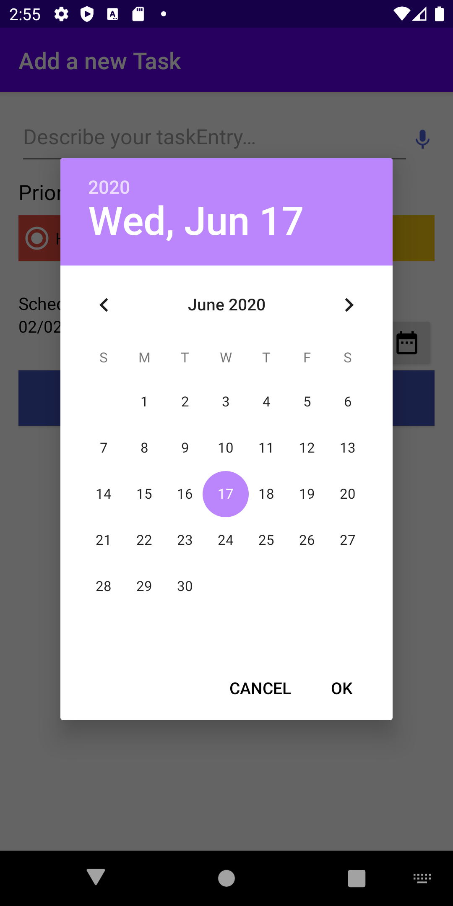

# android_todo

## Introduction

Todolist is an android application which is designed to keep record of activities or work people need to do. As human beings are being so busy in their life they need an application to remind what work they need to complete. Todolist app is designed so people don't need to remember all their work they need to do. foreg: assignment deadline, meeting they should attend and other.They keep the record of the work with date they must complete.

## Features

Some basic features of this ToDolist include add new tasks, edit an existing task, delete an existing task by swiping the task, set the task priority to high, medium or low. Besides these other features are mentioned below:

- Register and Login 

- Speech to text for adding description of task

- Menu that display About page

-  Swipe Navigation tab

- Calendar 

- TimePicker

## Database

- RoomDatabase

## Framework Used

### Model View View Model (MVVM) 

 MVVM is a structural design pattern that seperates objects into three distinct groups:

#### Models

##### Database

- App Database

- DateConverter

- TaskDao

- TaskEntry

- UserDao

- UserDatabase

- UserEntry

##### Adapter

- TabAdapter

- TaskAdapter

#### Views

<i>Fragment </i>

 - ProfileFragment
  
 - ReminderFragment
 
 - TodolistFragment
 
 <i>Activity</i>
 
 - AddEditTaskActivity
 
 - LoginActivity
 
 - RegisterActivity
 
 - MainActivity
 
 - MainFragment

#### View Models

- AddEditTaskViewModel

- AddEditTaskViewModelFactory

- TaskDateViewModel

- MainActivityViewModel

## Layout 

- Relative Layout

- Linear Layout

- Scroll View

- Frame Layout

## Coding Standards Used

- Proper Packaging

- Proper Commenting

- Proper Naming Convention

- XML Naming Convention

## Features

Login          |  Register                       | Calender             |  Time
:----------------------------:|:--------------------------------------:|:----------------------:|:-----------------
  |          |    | 

Swipe Views in Tabs         |  Swipe to Delete                     |  About            |  Logout
:----------------------------:|:--------------------------------------:|:----------------------:|:-----------------
  |   |   | 

AddTask         |  UpdateTask       |             
:----------------------------:|:--------------------------------------:|
  |  

## Validation 

### Register

User-Name Validate      |  Email Validate                    |  Password Validate            |  Re-Password Validate
:----------------------------:|:--------------------------------------:|:----------------------:|:-----------------
  |   |   | 

Un-Match Password      |
:----------------------------:|
 

### Login

User-Name Validate      |  Password Validate                   |  Non Register User |
:----------------------------:|:--------------------------------------:|:----------------------:|
  |   |  

## ToDoList App Guide

Home Page      |                           Login Page                   |  Register Page            | UserLogin
:----------------------------:|:--------------------------------------:|:----------------------:|:-----------------
  |   |   | 

ToDoPage      |                                  AddTask                   |  Task           |        Update
:----------------------------:|:--------------------------------------:|:----------------------:|:-----------------
  |   |   | 

Profile     |                                 PriorityHigh               |     About                |        
:----------------------------:|:-------------------------------------- :|:----------------------:|
  |   | 

