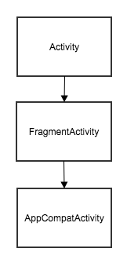

# android_todo

## Introduction

Todolist is an android application which is designed to keep record of activities or work people need to do. As human beings are being so busy in their life they need an application to remind what work they need to complete. Todolist app is designed so people don't need to remember all their work they need to do. foreg: assignment deadline, meeting they should attend and other.They keep the record of the work with date they must complete.

## Features

Some basic features of this ToDolist include add new tasks, edit an existing task, delete an existing task by swiping the task, set the task priority to high, medium or low. Besides these other features are mentioned below:

- Register and Login 

- Speech to text for adding description of task

- Menu that display About page

-  Swipe Navigation tab

- Calendar 

- TimePicker

## RoomDatabase

Room uses annotation with three main components

- @Entity - to define database table

- @DAO - to provide an API for reading and writing data

- @Database - represents a database holder

## Framework Used

### Model View View Model (MVVM) 

 MVVM is a structural design pattern that seperates objects into three distinct groups:

#### Models

##### Database

- App Database

- DateConverter

- TaskDao

- TaskEntry

- UserDao

- UserDatabase

- UserEntry

##### Adapter

- TabAdapter

- TaskAdapter

#### Views

<i>Fragment </i>

 - ProfileFragment
  
 - ReminderFragment
 
 - TodolistFragment
 
 <i>Activity</i>
 
 - AddEditTaskActivity
 
 - LoginActivity
 
 - RegisterActivity
 
 - MainActivity
 
 - MainFragment

#### View Models

- AddEditTaskViewModel

- AddEditTaskViewModelFactory

- TaskDateViewModel

- MainActivityViewModel

## Layout 

- Relative Layout

- Linear Layout

- Scroll View

- Frame Layout

## Development

1. Master

1.1 LoginRegister Branch

1.2 Navigation  Branch 

1.3 AddTodoList Branch

1.4 SpeechtoText Branch

1.5 Menu Branch

1.6 Profile Branch

1.7 Calendar Branch

1.8 Reminder Branch

1.9 Timepicker Branch

## Coding Standards Used

- Proper Packaging

- Proper Commenting

- Proper Naming Convention

- XML Naming Convention

## Features

Login          |  Register                       | Calender             |  Time
:----------------------------:|:--------------------------------------:|:----------------------:|:-----------------
  |          |    | 

Swipe Views in Tabs         |  Swipe to Delete                     |  About            |  Logout
:----------------------------:|:--------------------------------------:|:----------------------:|:-----------------
  |   |   | 

AddTask         |  UpdateTask       |             
:----------------------------:|:--------------------------------------:|
  |  

## Validation 

### Register

User-Name Validate      |  Email Validate                    |  Password Validate            |  Re-Password Validate
:----------------------------:|:--------------------------------------:|:----------------------:|:-----------------
  |   |   | 

Un-Match Password      |
:----------------------------:|
 

### Login

User-Name Validate      |  Password Validate                   |  Non Register User |
:----------------------------:|:--------------------------------------:|:----------------------:|
  |   |  

## ToDoList App Guide

Home Page      |                           Login Page                   |  Register Page            | UserLogin
:----------------------------:|:--------------------------------------:|:----------------------:|:-----------------
  |   |   | 

ToDoPage       |                                  AddTask                   |  Task           |        Update
:----------------------------:|:--------------------------------------:|:----------------------:|:-----------------
  |   |   | 

Profile                |           PriorityHigh               |     About          |        
:----------------------------:|:--------------------------------------:|:--------------------------------------:|
  |   | 

## Documentation

### MVVM

MVVM is one of the architectural patterns which enhances separation of concerns, it allows separating the user interface logic from the business (or the back-end) logic. Its target (with other MVC patterns goal) is to achieve the following principle “Keeping UI code simple and free of app logic in order to make it easier to manage”.MVVM stands for Model, View, ViewModel.

Model: This holds the data of the application. It cannot directly talk to the View. Generally, it’s recommended to expose the data to the ViewModel through Observables.
View: It represents the UI of the application devoid of any Application Logic. It observes the ViewModel.
ViewModel: It acts as a link between the Model and the View. It’s responsible for transforming the data from the Model. It provides data streams to the View. It also uses hooks or callbacks to update the View. It’ll ask for the data from the Model.

 

### Activity LifeCycle

Activity has four states
active (or running at the top of the activity stack)
paused — alive in memeory, visible, lost focus
stopped — obscured by another activity, alive in memory, not visible
paused or stopped — may lead to destroyed and restarted to previous state

 

### LifeCycle Class and Observer Pattern

 

### Activity

 Activity is a single screen in an app
 
 ### Intent
 
 Intent is a messaging object to request an action from another app component. 
 Intent is a message object to start an activity.

### Fragment

A Fragment represents a behaviour or a portion of user interface, has its own lifecycle, receives its own input events, and can be added or removed while the activity is running. Fragment can be dynamically loaded allowing for flexible UI.

 

### ViewModel

ViewModel is lifecycle aware. ViewModel objects scoped to the lifecycle passed to the ViewModelProvider.

 

## References

- Navigation Components : https://developer.android.com/guide/navigation/navigation-getting-started

- Material Components : https://material.io/develop/android/docs/getting-started/

- Android Widget : https://developer.android.com/reference/android/widget/package-summary

- Creating Task Fragment:https://github.com/ebbi/TaskFragment]TodoViewModel:https://github.com/ebbi/TodoViewModel

- Todo app Model View ViewModel architecture:https://github.com/ebbi/TodoMVVM

- Entity : https://developer.android.com/reference/android/arch/persistence/room/Entity

- Options Menus  : https://developer.android.com/guide/topics/ui/menus

- Create views : https://developer.android.com/training/data-storage/room/creating-views

- Query for Database : https://developer.android.com/reference/android/arch/persistence/room/Query

- Calendar Builder for Todo : https://developer.android.com/reference/java/util/Calendar.Builder

## License

  

- **[MIT license](http://opensource.org/licenses/mit-license.php)**

